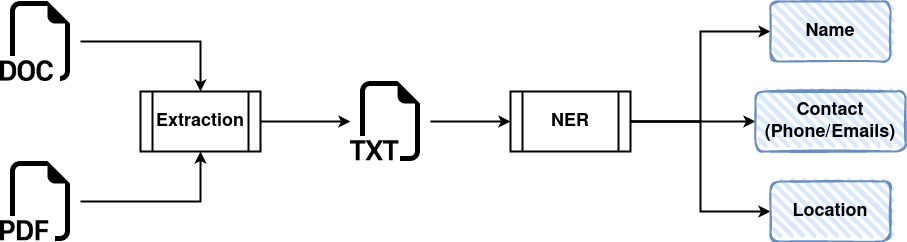

### <center>ACL Assignment</center>

---

> **Statement**:  
Given an unstructured document, we need to extract Names, Places, Contacts (Phone/email) and Addresses from the document.



__Use Case__  
The customer wants to extract the entities such as name, location and contacts from the document and store it in their database for further use.

__Assumptions__  
  * Document could be in any format (PDF, doc, txt) - not handwritten or scanned [For that one has to first extract the text using OCR]
  * There is no limit to the number of pages in the doucment, ie., could be a multipage document

__Scope__  
  * Given a text document, extract the text, clean it, and extract entities, namely, __`name`, `location`, `email address`, `phone number`__ from the it.
  * Documents are computer typed and not scanned or handwritten
  * There are no documents provided for fine-tuning the model and improving the precision of recognition of the entities
  * The output has to be printed in a file and stored in a temp folder apart from also printing it on the terminal
  * No Pipeline needed for this project
  * There is no component of deployment and scaling of the application mentioned/required.
  * Input document file is to be provided by the user.

__How to run this application__ 
  * Create a virtual environment
  ```conda create -n nlp python=3.8.0```
  * Install all the libraries
  ```pip install -r requirements.txt```
  * Run the pipeline invoking the pythons main 
  ```python main.py --input /path/to/input/file```
